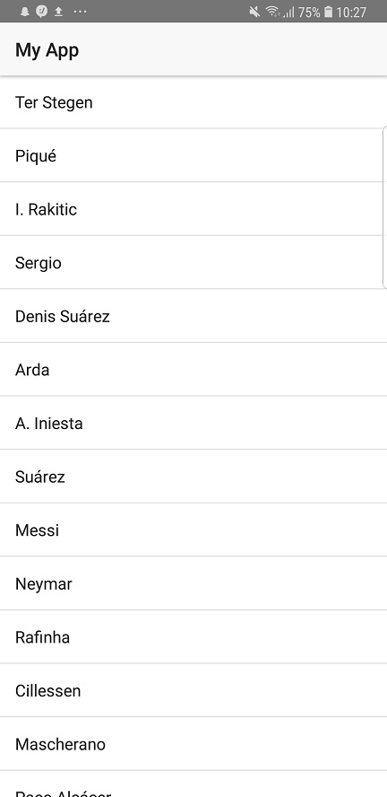
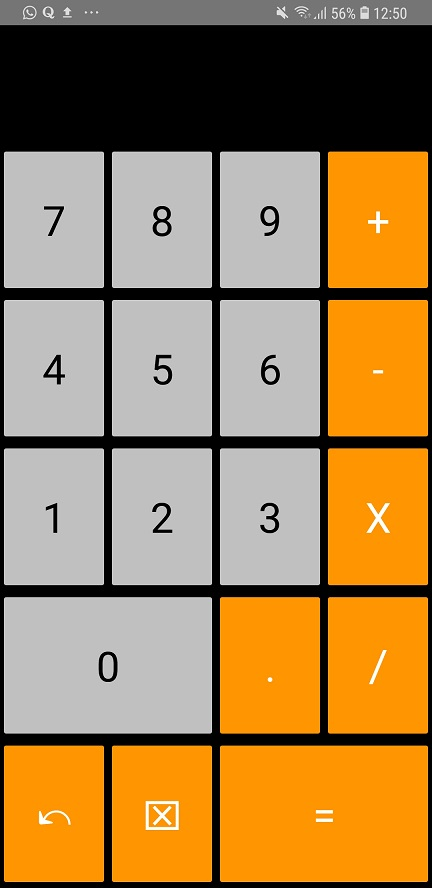
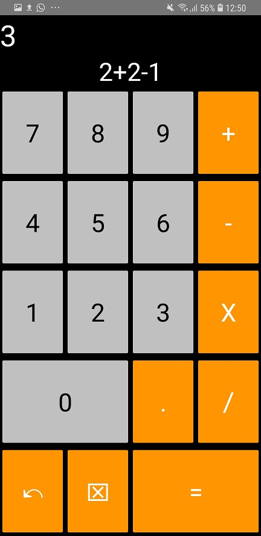
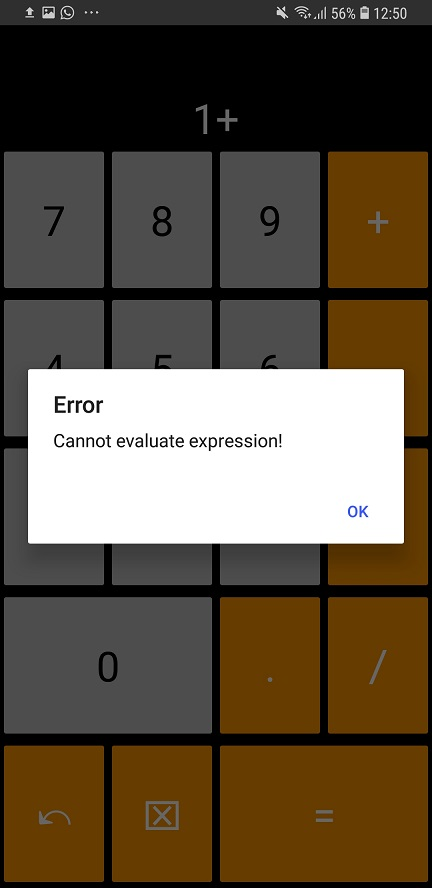

# NativeScript: A short introduction

## Intro

NativeScript is a cross-platform app development framework that lets you build native iOS and Android applications using TypeScript or JavaScript code. NativeScript utilizes either Angular or Vue.js as the underlying UI technology and converts the UI (no matter what framework you write in) to native components (hence: **Native**Script).

## Requirements

To install and run NativeScript you need to have both Node.js and the Android SDK installed on your development machine. 

On Windows you can install these tools using Chocolatey:

```bash
#install Chocolatey
PS C:\WINDOWS\system32> Set-ExecutionPolicy Bypass -Scope Process -Force; iex ((New-Object System.Net.WebClient).DownloadString('https://chocolatey.org/install.ps1'))
#install Node.js
PS C:\WINDOWS\system32> choco install nodejs -y
#install Android SDK
PS C:\WINDOWS\system32> choco install androidstudio -y
```

And on Debian based Linux distros like so:

```bash
$ sudo apt update
#add dependency for Node.js
$ curl -sL https://deb.nodesource.com/setup_11.x | sudo -E bash -
#install Node.js
$ sudo apt install -y nodejs
#install Android SDK
$ curl https://gist.githubusercontent.com/bmc08gt/8077443/raw/48873eed88a015956c13681548385e4a01b6acbd/setup_android_studio.sh | sudo bash
```

## Install

The NativeScript install itself is quite easy and the same no matter the operating system. I will be proceeding on a Linux system (Ubuntu 18.04 LTS 64bit to be precise) since I prefer the Linux bash an the build chain on Linux over the Windows one.

```bash
$ cd ~
$ sudo npm i -g nativescript
$ tns --version
#if correctly installed, this should output the version of NativeScript CLI
```

Furthermore, you will need to install the NativeScript Playground app and the NativeScript Preview app on your smartphone. This will be needed to test, debug and run the app.

## Getting started

In the following tutorial we will be writing a simple calculator application using NativeScript. I will be using Visual Studio Code with the NativeScript extension but you can use the IDE/editor of your choice.

### Creating the project

Lets start by creating all the necessary project files and installing the npm dependencies for the project. We can do that  with the `tns create` command.

```bash
$ mkdir -p ~/workspace
$ cd ~/workspace
$ tns create NativeScriptCalculator --ng
$ cd NativeScriptCalculator
$ npm i
$ tns preview
```

Now, switch to your phone, open the Playground app and scan the QR code on the screen.
You should see something similar to this:



Now that NativeScript is running, we can switch to our development environment and start programming.

## Project structure

When we open our project, we will find that the structure of the project is quite similar to that of an Angular project. Lets take a closer look at it:

```bash
$ sudo apt install -y tree
$ tree -d ~/workspace/NativeScriptCalculator
├── App_Resources #here, app resources are stored for each platform
│   ├── Android
│   └── iOS
├── hooks #in the hooks folder you can find the NativeScript build pipeline
├── node_modules #the node_modules folder stores our dependencies and libraries
├── platforms #the platforms folder stores operating system specific code
│   └── android
└── src
    └── app
        └── item #the item component was generated by NativeScript
```

## The UI

As we will be writing the UI from scratch, we can just delete the `Item` component generated by the `tns create` command and write directly to the `app.component`. Our `src` folder should now look like so:


Our UI code (in `app.component.html`) will look like so:

```html
<GridLayout columns="*, *, *, *" rows="auto, auto, *, *, *, *, *" >
  <Label class="result" text="" colSpan="4"></Label>
  <Label text="" row="1" colSpan="4"></Label>
  <Button row="2" class="numbers" col="0" text="7"></Button>
  <Button row="2" class="numbers" col="1" text="8"></Button>
  <Button row="2" class="numbers" col="2" text="9"></Button>
  <Button row="2" class="controls" col="4" text="+"></Button>
  <Button row="3" class="numbers" col="0" text="4"></Button>
  <Button row="3" class="numbers" col="1" text="5"></Button>
  <Button row="3" class="numbers" col="2" text="6"></Button>
  <Button row="3" class="controls" col="4" text="-"></Button>
  <Button row="4" class="numbers" col="0" text="1"></Button>
  <Button row="4" class="numbers" col="1" text="2"></Button>
  <Button row="4" class="numbers" col="2" text="3"></Button>
  <Button row="4" class="controls" col="3" text="X"></Button>
  <Button row="5" class="numbers" col="0" colSpan="2" text="0"></Button>
  <Button row="5" class="controls" col="2" text="."></Button>
  <Button row="5" class="controls" col="3" text="/"></Button>
  <Button row="6" class="controls" col="0" text="↶"></Button>
  <Button row="6" class="controls" col="1" text="⌧"></Button>
  <Button row="6" class="controls" col="2" colSpan="2" text="="></Button>
</GridLayout>
```

And our styling (in `app.css`) like so:

```css
@import '~nativescript-theme-core/css/core.light.css';

button, label{
    horizontal-align: center;    
}

gridlayout{
    background-color: black;
}

label {
    font-size: 36;
    color: white;
}

label.result {
    font-size: 42;
    horizontal-align: left;
    color: white;
}

button{
    font-size: 36;
    width: 100%;
}

.controls{
    background-color: rgb(255, 149, 0);
    color: white;
}

.numbers{
    background-color: #C0C0C0;
    color: black;
}
```

Your app should look like this:



As you might have already noticed, we are not working with HTML tags. Instead, we use the Angular components exposed by the NativeScript API. The NativeScript API is the core system that makes NativeScript work. It takes Vue.js or Angular UI declarations and converts them to native components.

## The logic

Now that we have a nice looking UI, lets add some logic to it. Our calculator should be able to append an operation, undo operations and clear the screen. When a users clicks on the `=` button, the expression should be evaluated and the result shall be printed to the screen. 

So lets take a look at our `app.component.ts`:

```typescript
import { Component } from "@angular/core";

@Component({
    selector: "calculator",
    moduleId: module.id,
    templateUrl: "./app.component.html",
})
export class AppComponent { 
    constructor() { }
    operation: string = '';
    result: string= '';

    append(element: string){
        this.operation += element;
    }
    
    undo(){
        if (this.operation != ''){
            this.operation = this.operation.slice(0, -1)
        }
    }
    
    clear(){
        this.operation = '';
    }
    
    evaluate(){
        this.result = eval(this.operation.replace("X","*"));
        console.log(this.result);
    }

    ngOnInit(): void {
    }
}
```

Now we just need to register these events in `app.component.html`. We do that with `(tap)` (which behaves similar to `(click)` in regular Angular). We also bind the operation and result variable with the two labels at the top. Just like in regular Angular, we do that with `{{ }}`.

```html
<GridLayout columns="*, *, *, *" rows="auto, auto, *, *, *, *, *" >
  <Label class="result" text="{{ result }}" colSpan="4"></Label>
  <Label text="{{ operation }}" row="1" colSpan="4"></Label>
  <Button (tap)="append('7')" row="2" class="numbers" col="0" text="7"></Button>
  <Button (tap)="append('8')" row="2" class="numbers" col="1" text="8"></Button>
  <Button (tap)="append('9')" row="2" class="numbers" col="2" text="9"></Button>
  <Button (tap)="append('+')" row="2" class="controls" col="4" text="+"></Button>
  <Button (tap)="append('4')" row="3" class="numbers" col="0" text="4"></Button>
  <Button (tap)="append('5')" row="3" class="numbers" col="1" text="5"></Button>
  <Button (tap)="append('6')" row="3" class="numbers" col="2" text="6"></Button>
  <Button (tap)="append('-')" row="3" class="controls" col="4" text="-"></Button>
  <Button (tap)="append('1')" row="4" class="numbers" col="0" text="1"></Button>
  <Button (tap)="append('2')" row="4" class="numbers" col="1" text="2"></Button>
  <Button (tap)="append('3')" row="4" class="numbers" col="2" text="3"></Button>
  <Button (tap)="append('X')" row="4" class="controls" col="3" text="X"></Button>
  <Button (tap)="append('0')" row="5" class="numbers" col="0" colSpan="2" text="0"></Button>
  <Button (tap)="append('.')" row="5" class="controls" col="2" text="."></Button>
  <Button (tap)="append('/')" row="5" class="controls" col="3" text="/"></Button>
  <Button (tap)="undo()" row="6" class="controls" col="0" text="↶"></Button>
  <Button (tap)="clear()" row="6" class="controls" col="1" text="⌧"></Button>
  <Button (tap)="evaluate()" row="6" class="controls" col="2" colSpan="2" text="="></Button>
</GridLayout>
```

And now we can do some calculations! The app should look like so:



## Adding error handling

So now that we have all the functionality in our app, lets add some error handling to prevent the application to crash when the calculation doesn't evaluate. When the calculation fails, we want a dialog to pop up and an error information to appear in the log.

First, we need to import the dialog module in `app.component.ts`:

```typescript
import dialogs = require("ui/dialogs");
```

Next, lets add a try/catch block in our `evaluate` method:

```typescript
evaluate(){
    try{
        this.result = eval(this.operation.replace("X","*"));
        console.log(this.result);
    }catch(e){
        console.error("Cannot evaluate expression!");
        dialogs.alert({title: 'Error', message: 'Cannot evaluate expression!', okButtonText: 'OK'});
    }
}
```

Lets test this out. The dialog should look like so:



## Conclusion

And Voila! There we have our own little calculator written in NativeScript! In conclusion I can say that NativeScript with Angular is definitely a nice framework which makes cross-platform development way easier than doing it the old-fashioned way (that is having a native application for each platform) but it's immaturity and small community make it quite a lot harder to use than other well-established cross-platform SDKs like React Native, Flutter or Ionic. Give NativeScript a couple more months, a more engaged and better integrated community and you have yourself the perfect cross-platform toolkit.

